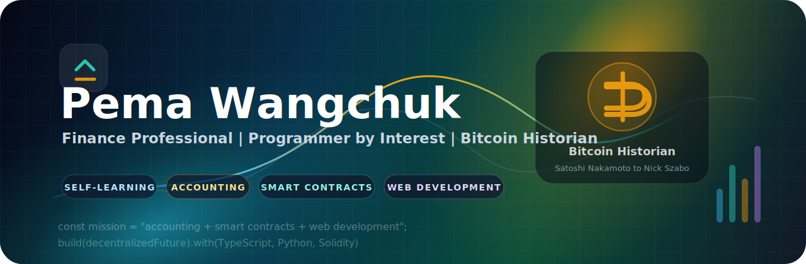
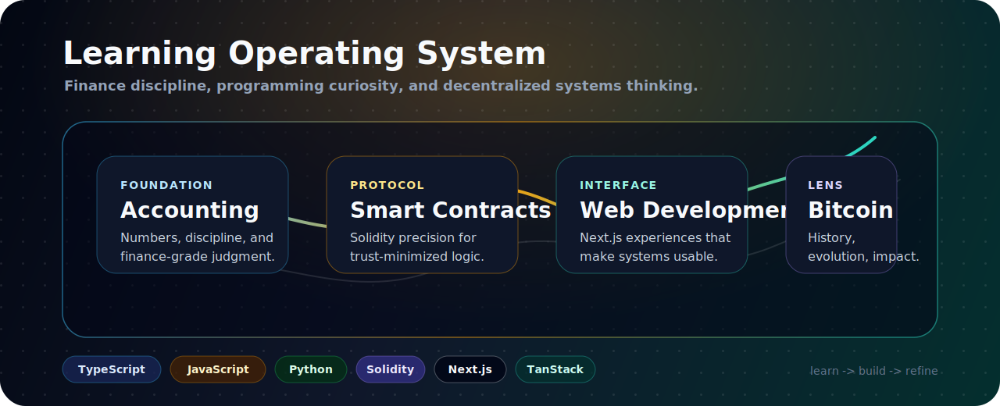

 
 

<h1>👋 Hello, I'm Pema Wangchuk</h1>

<h3>Finance mind. Builder spirit. Bitcoin history lens.</h3>

 
 

 
 

---

### <a href="#-professional-snapshot">Professional Snapshot</a> · <a href="#-technical-arsenal">Technical Arsenal</a> · <a href="#-my-mission">Mission</a> · <a href="#-currently-immersed-in">Currently Learning</a> · <a href="#-github-metrics">GitHub Metrics</a> · <a href="#-connect-with-me">Connect</a>

---

## ✦ Professional Snapshot

<table>
  <tr>
    <td width="58%" valign="top">
      <h3>🤠 Who Am I?</h3>
      
👋 Hello! I'm a passionate believer in self-learning. I am a finance professional by trade and a programmer by interest, aiming to combine both skills to build innovative solutions.

       
      <table>
        <tr>
          <td align="center"><strong>💼 Finance</strong> Professional foundation</td>
          <td align="center"><strong>🧠 Self-learning</strong> Discipline-driven growth</td>
        </tr>
        <tr>
          <td align="center"><strong>🧩 Builder</strong> Web + smart contracts</td>
          <td align="center"><strong>₿ Research</strong> Bitcoin history lens</td>
        </tr>
      </table>
    </td>
    <td width="42%" valign="top">
      <h3>📜 Bitcoin Historian</h3>
      
🌍 I am deeply intrigued by Bitcoin's revolutionary journey. I enjoy exploring its history, evolution, and transformative impact—from the mysteries of <strong>Satoshi Nakamoto</strong> to the groundbreaking work of pioneers like <strong>Nick Szabo</strong>.

       
      

        
         
        
      

    </td>
  </tr>
</table>

---

## 🚀 Technical Arsenal

<strong>Languages, frameworks, tools, and platforms I am actively learning and using.</strong>

 
 

<table>
  <tr>
    <td align="center" width="25%"><strong>Frontend</strong> Next.js · React · Tailwind CSS</td>
    <td align="center" width="25%"><strong>Languages</strong> TypeScript · JavaScript · Python</td>
    <td align="center" width="25%"><strong>Web3</strong> Solidity · Smart Contracts</td>
    <td align="center" width="25%"><strong>Data / Tools</strong> Supabase · MongoDB · Git · GitHub</td>
  </tr>
</table>

---

## 🎯 My Mission

> 🎓 My goal is clear: to keep learning accounting, smart contracts, and web development with a specific focus on **TypeScript, JavaScript, Python, and Solidity**, and frameworks like **Next.js** and **TanStack**.

  

---

## 🌱 Currently Immersed In

<table>
  <tr>
    <td width="33%" valign="top">
      <h3>🌐 Next.js</h3>
      
Crafting dynamic and efficient web experiences.

      

    </td>
    <td width="33%" valign="top">
      <h3>📜 Solidity</h3>
      
Bringing smart contracts to life with precision.

      

    </td>
    <td width="33%" valign="top">
      <h3>⚙️ TypeScript & JavaScript</h3>
      
Building robust and scalable solutions.

      

    </td>
  </tr>
</table>

---

## 💹 GitHub Metrics

<strong>A quick look at my GitHub activity, language focus, and development consistency.</strong>

 
 

 
 

---

## 📫 Connect with Me

<table>
  <tr>
    <td width="65%" valign="middle">
      
If you are interested in finance, Bitcoin history, web development, smart contracts, or self-learning, feel free to connect.

      
<i>"Let’s code, innovate, and shape the decentralized future together! 🚀✨"</i>

    </td>
    <td width="35%" align="center" valign="middle">
      
    </td>
  </tr>
</table>

