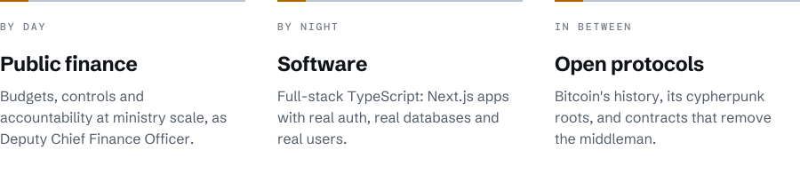
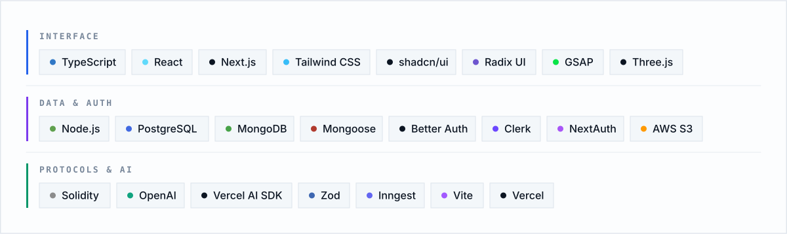
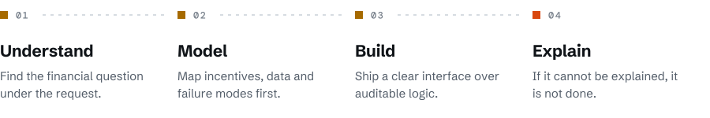
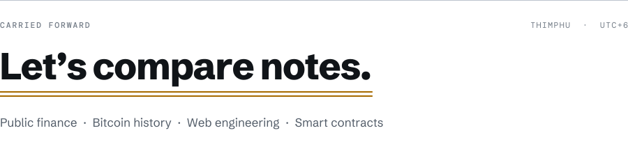

<picture>
  <source media="(prefers-color-scheme: dark)" srcset="./assets/hero-dark.svg">
  
</picture>

  <a href="https://github.com/pemawangchuk2023?tab=repositories">
    <picture>
      <source media="(prefers-color-scheme: dark)" srcset="./assets/btn-repos-dark.svg">
      
    </picture>
  </a>
  <a href="https://linkedin.com/in/pema-wangchuk-5561aa224">
    <picture>
      <source media="(prefers-color-scheme: dark)" srcset="./assets/btn-linkedin-dark.svg">
      
    </picture>
  </a>
  <a href="https://github.com/pemawangchuk2023?tab=stars">
    <picture>
      <source media="(prefers-color-scheme: dark)" srcset="./assets/btn-stars-dark.svg">
      
    </picture>
  </a>

## Selected work

<picture>
  <source media="(prefers-color-scheme: dark)" srcset="./assets/work-head-dark.svg">
  
</picture>
<a href="https://www.search-here.space/">
  <picture>
    <source media="(prefers-color-scheme: dark)" srcset="./assets/work-fdh-dark.svg">
    
  </picture>
</a>
<a href="https://recorder-murex-rho.vercel.app">
  <picture>
    <source media="(prefers-color-scheme: dark)" srcset="./assets/work-recorder-dark.svg">
    
  </picture>
</a>

## Practice

<picture>
  <source media="(prefers-color-scheme: dark)" srcset="./assets/practice-dark.svg">
  
</picture>

## Stack

<picture>
  <source media="(prefers-color-scheme: dark)" srcset="./assets/stack-dark.svg">
  
</picture>

## How I work

<picture>
  <source media="(prefers-color-scheme: dark)" srcset="./assets/loop-dark.svg">
  
</picture>

 
 

<picture>
  <source media="(prefers-color-scheme: dark)" srcset="./assets/footer-dark.svg">
  
</picture>

  <a href="https://linkedin.com/in/pema-wangchuk-5561aa224">LinkedIn</a>
  &nbsp;·&nbsp;
  <a href="https://github.com/pemawangchuk2023?tab=repositories">Repositories</a>
  &nbsp;·&nbsp;
  <a href="https://github.com/pemawangchuk2023?tab=stars">Reading list</a>

